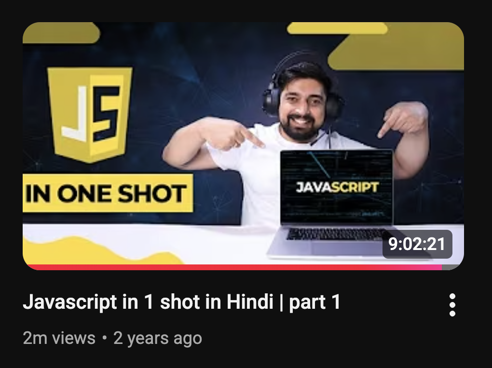
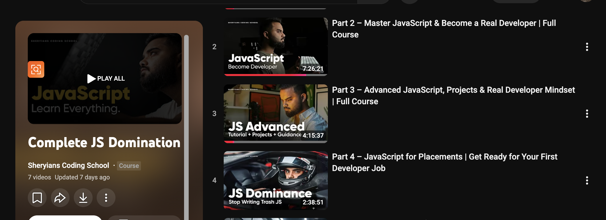

# Javascript

I am currently learning JavaScript from Chai aur Code and Sheryians Coding School. This repository is created for my revision and practice during my learning journey.

Here, I store my notes, concepts, and small projects to strengthen my fundamentals and track my progress in JavaScript.

🚀 Topics Covered:
🔹 Part 1 – JavaScript Basics (Chai aur Code)
Setting up environment
Working with GitHub
let, const, var
Datatypes & ECMA standards
Datatype conversion
String to number conversion
Comparison of datatypes
Datatypes summary
Stack & Heap memory
Strings in JavaScript
Numbers & Math
Date & Time
Arrays (Part 1 & 2)
Objects (Part 1 & 2)
Object destructuring & JSON API
Functions & parameters
Functions with objects
Global & local scope
Scope & hoisting
this keyword & arrow functions
Immediately Invoked Function (IIFE)
How JavaScript works behind the scenes
Control flow
Loops (for, while, do-while)
High order array methods
filter, map, reduce
🔗 Chai aur Code (JavaScript Full Course):
https://youtu.be/sscX432bMZo

🔹 Part 2 – DOM & Advanced Concepts (Sheryians Coding School)
Introduction
DOM (Document Object Model)
Events & Event Handling
Forms & Form Validation
Timers & Intervals
localStorage, sessionStorage & Cookies
Practice Questions
🔗 Sheryians Coding School Playlist:
https://www.youtube.com/playlist?list=PLbtI3_MArDOnNvk8CCCSR01CQ8B8iNh-A
